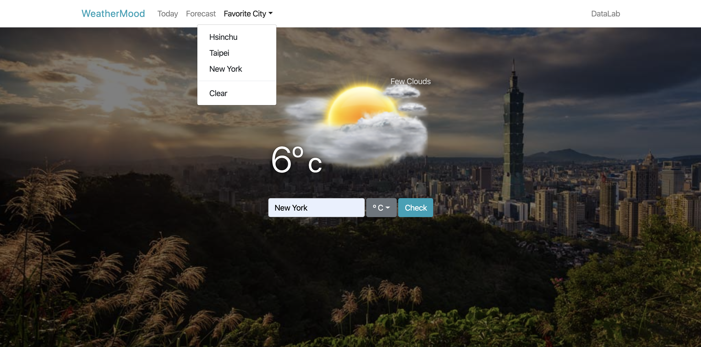

# Lab 5 - Weather-Mood-Cookie

In this lab, you should understand the basic coding style using react, and how to use cookie in a website. 
There are many ways to complete this lab, and you can modify the code as you like. 
`To test the code, you should run "npm install" first, and run "npm run start" sequently.`

## Grading
1. If you don't have a api key of open weather map, register one. (20%)
2. After you click the 'check' button, the city you search should apper on the 'favorite city' dropdown. (20%)
3. The 'favorite city' should presist even if you refresh the page. (20%)
4. After clicking on a 'favorite city', the website should show the temprature of the clicked city. (20%)
5. After clicking 'clear' button, all 'favorite city' should be removed. (20%)

## Submission
Open a new merge request when you finished your quiz 
Submission must before 4/22 17:20 
**LATE-SUBMISSION WILL NOT BE ACCEPTED! **
