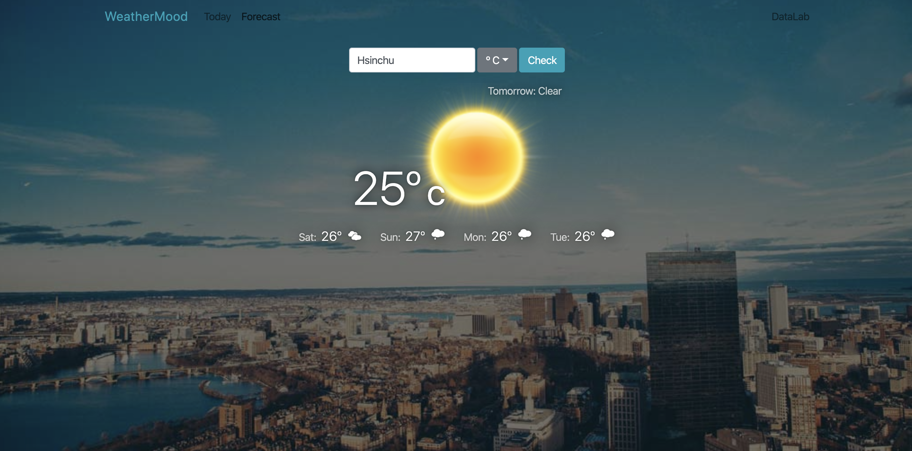

# HW 4 - React Weather Forecast

## Grading
You can use the data in the 5 day / 3 hour api or use 16 day / daily forecast data.

If you are not using OpenWeatherMap API to get weather data, you will get 0 points. 

1.  (20%) Present weather of the first day on top of the weather table correctly.
2.  Present weather of the second to the fifth day in the weather table component (total 60%)
    - (10%) Using icon from http://websygen.github.io/owfont/
    - (20%) Display weekdays (Mon, Tue, Wed, ...) correctly.
    - (30%) Display temperature correctly.
3. (20%) Responsive : Show only the second to the third day in the weather table component on portrait mobile devices.

## Deadline
Sumbit your work before 2019/04/29 (Thur) 23:59.

## Important
`To test the code, you should run "npm install" first, and run "npm run start" sequently.` 
Open a new merge request when you finished your quiz 
Name your merge request as <your_student_id>_submission 
**LATE-SUBMISSION WILL NOT BE ACCEPTED! **
